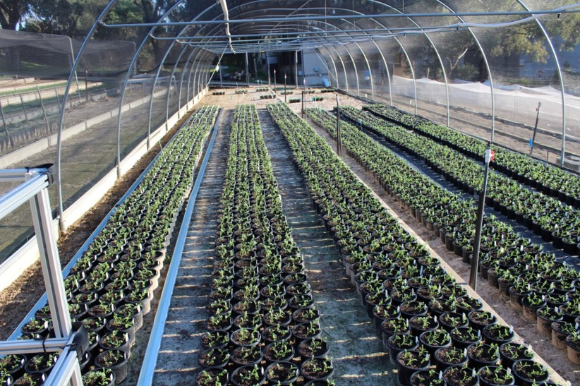
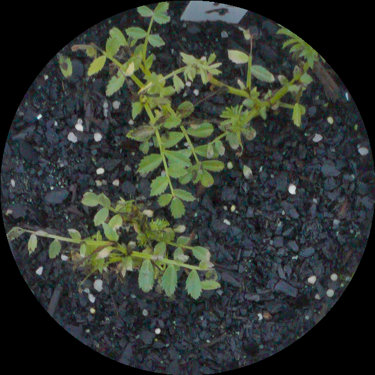
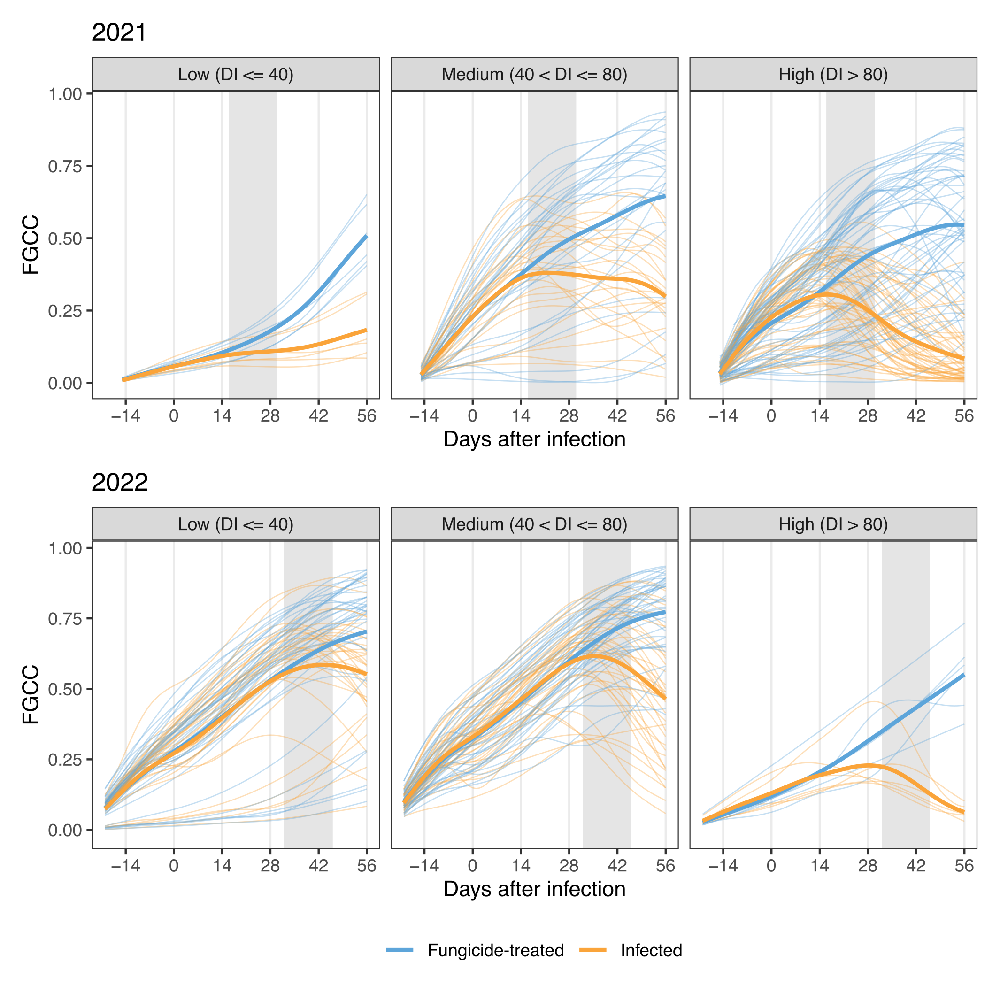

# ab_screen_methods

Code supporting the article "Time course sensor-based phenotyping can predict Ascochyta blight disease severity in Cicer species"

  
  

## Description

Methods for the analysis of RGB and multipectral images acquired in an Ascochyta Blight disease resistance screen of chickpea and wild Cicer material.
[Link to article]()

## Contents

- Functions in /R
- Scripts for analysis in /inst
- Raw data at Dryad: https://doi.org/10.5061/dryad.15dv41pbw
	* 2020: RGB images
	* 2021: RGB images and multispectral images
	* 2022: RGB images and multispectral images
	* 2021: Automated phenotyping system, full data available at https://data.pawsey.org.au/download/APPF/public_experiments/0539_PH_UA_TPA_Tanner_Chickpea.tar
	* Annotated data for object detection 
	* Score data
- Processed trait data and score data in repository /data-raw
	- see Data dictonary

## Data dictionary

### Trait data 

[2020_main.csv](data-raw/trait_data/2020_main.csv)
[2021_main.csv](data-raw/trait_data/2021_main.csv)
[2022_main.csv](data-raw/trait_data/2022_main.csv)

| variable     | class     | description                                        |
|--------------|-----------|----------------------------------------------------|
| pot          | character | Pot ID                                             |
| date         | date      | Imaging date                                       |
| genotype_id  | character | Genotype ID                                        |
| type         | character | Type of genotype                                   |
| row          | integer   | Row - design                                       |
| column       | integer   | Column - design                                    |
| rep          | integer   | Rep                                                |
| fgcc         | double    | Fractional Green Canopy Cover (Canon)              |
| n_lesions    | double    | Number of lesions detected with yolov5             |
| size_lesions | double    | Ratio of area of pot covered with lesions (yolov5) |

Additional variables for:
[2021_fungicide.csv](data-raw/trait_data/2021_fungicide.csv)
[2022_fungicide.csv](data-raw/trait_data/2022_fungicide.csv)

| variable       | class     | description                                     |
|----------------|-----------|-------------------------------------------------|
| …              | …         | …                                               |
| treatment      | character | +/- Fungicide treatment                         |
| canon_fgcc     | double    | FGCC calculated from Canon DSLR                 |
| rededge_fgcc   | double    | FGCC calculated from Micasense RedEdge          |
| ndvi           | double    | Normalized Difference Vegetation Index          |
| endvi          | double    | Enhanced Normalized Difference Vegetation Index |
| rendvi         | double    | Normalized Difference RedEdge Index             |
| ngrdi          | double    | Normalized Green-Red Difference Index           |
| gndvi          | double    | Green NDVI                                      |

[2021_lemna_fgcc.csv](data-raw/trait_data/2021_lemna_fgcc.csv)

| variable                     | class     | description                                     |
|------------------------------|-----------|-------------------------------------------------|
| date                         | character | Date of imaging                                 |
| pot                          | character | Pot ID                                          |
| lemna_fgcc                   | double    | FGCC calculated from Lemna Imaging              |
| hyperspec                    | logical   | Was hyperspectral imaging performed?            |
| projected_shoot_area_pixels  | double    | Projected shoot area in pixels from Lemna       |

### Score data

[scores_2020.csv](data-raw/score_data/scores_2020.csv)
[scores_2021.csv](data-raw/score_data/scores_2021.csv)
[scores_2022.csv](data-raw/score_data/scores_2022.csv)

| variable     | class     | description                                        |
|--------------|-----------|----------------------------------------------------|
| pot          | character | Pot ID                                             |
| di           | double    | Disease index                                      |

Additional variables for:
[rescoring_2021.csv]()

| variable       | class     | description                                     |
|----------------|-----------|-------------------------------------------------|
| …              | …         | …                                               |
| date           | date      |  Date of scoring                                |
| time           | time      | Time of scoring                                 |
| round          | integer   | Round of scoring                                |
| scorer         | character | ID for pathologist who scored                   |